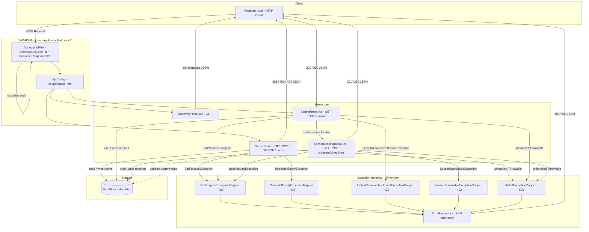

# SmartCampusAPI

---

## API Design Overview

SmartCampusAPI is a RESTful web service built with **Java 17**, **Jakarta REST (JAX-RS)**, and deployed on **GlassFish 7**. It provides in-memory management of campus rooms, sensors, and sensor readings — no database is used.

### Base URL

```
http://localhost:8080/SmartCampusAPI/api/v1
```

### System Architecture



### Key Design Decisions

| Concern | Approach |
|---|---|
| **Storage** | Static `HashMap` / `ArrayList` in `DataStore` — shared across all request instances |
| **Resource lifecycle** | Request-scoped (default) — fresh instance per HTTP request |
| **Sub-resource pattern** | `SensorResource` delegates `/readings` routes to `SensorReadingResource` via a sub-resource locator |
| **Error handling** | Five `ExceptionMapper` providers (`400`, `403`, `409`, `422`, `500`) — all return structured JSON, no raw stack traces |
| **Logging** | `ApiLoggingFilter` implements both `ContainerRequestFilter` and `ContainerResponseFilter` — logs every request method, URI, and response status centrally |
| **Discovery / HATEOAS** | `DiscoveryResource` at `GET /api/v1` exposes all resource links at runtime |

### Endpoint Summary

| Method | Path | Response | Description |
|---|---|---|---|
| `GET` | `/api/v1` | 200 | API metadata and resource links |
| `GET` | `/api/v1/rooms` | 200 | List all rooms |
| `POST` | `/api/v1/rooms` | 201 + Location | Create a room |
| `GET` | `/api/v1/rooms/{id}` | 200 / 404 | Get room by ID |
| `DELETE` | `/api/v1/rooms/{id}` | 200 / 404 / 409 | Delete room (blocked if sensors attached) |
| `GET` | `/api/v1/sensors` | 200 | List all sensors (optional `?type=` filter) |
| `POST` | `/api/v1/sensors` | 201 / 422 | Register a sensor (validates roomId exists) |
| `GET` | `/api/v1/sensors/{id}/readings` | 200 | Get reading history for a sensor |
| `POST` | `/api/v1/sensors/{id}/readings` | 201 / 403 | Post a reading (blocked if sensor is MAINTENANCE) |
| `GET` | `/api/v1/errors/trigger-500` | 500 | Intentionally trigger runtime failure to validate global mapper |

### Error Response Format

All errors return a structured JSON body — no stack traces are exposed to the client:

```json
{
  "status": 409,
  "error": "Conflict",
  "message": "Cannot delete room: It has active sensors attached.",
  "path": "/api/v1/rooms/LAB-201",
  "timestamp": 1745270400000
}
```

---

## Build & Run Instructions

### Prerequisites

- **Java 17** (JDK) installed and configured
- **Apache NetBeans 20+** (or any IDE supporting GlassFish deployment)
- **GlassFish 7** server registered in your IDE

### Steps

**1. Clone / open the project**

Open the `SmartCampusAPI` project folder in NetBeans via `File → Open Project`.

**2. Verify the GlassFish server is configured**

Go to `Tools → Servers`. If GlassFish is not listed:
- Click `Add Server` → choose `GlassFish Server`
- Point it to your GlassFish 7 installation directory
- Click `Finish`

**3. Clean and build the project**

In the Projects panel, right-click `SmartCampusAPI` → `Clean and Build` (or press `Shift + F11`).

This compiles the source, runs annotation processing, and packages the application as a `.war` file inside the `target/` directory.

**4. Deploy and run**

Right-click the project → `Run` (or press `F6`).

NetBeans will start GlassFish, deploy the WAR automatically, and open the server log in the Output panel.

**5. Verify the server is live**

Open a browser or Postman and call:

```
GET http://localhost:8080/SmartCampusAPI/api/v1
```

A 200 JSON response with API metadata confirms successful deployment.

> **Tip:** If you receive a 404, try the snapshot URL:
> `http://localhost:8080/SmartCampusAPI-1.0-SNAPSHOT/api/v1`

**6. Run requests**

Use the included **Postman collection** to exercise all endpoints, including happy-path and error-path scenarios (409, 422, 403, 500).

---

## Conceptual Report

---

## Part 1.1 — Project and Application Configuration

**Question:** Explain the default lifecycle of a JAX-RS Resource class, and the impact on in-memory maps/lists.

**Answer:**
In this project, the `ApiConfig` class extends `jakarta.ws.rs.core.Application` and is annotated with `@ApplicationPath("/api/v1")`, which registers the API entry point. All resource classes (`SensorRoom`, `SensorResource`, `DiscoveryResource`) are **request-scoped by default**, meaning JAX-RS creates a fresh instance of each class for every incoming HTTP request. Because of this, instance fields like the injected `UriInfo` are safe per request and do not leak between clients.

However, the shared data lives in `DataStore`, which holds three static `ConcurrentHashMap`/`ArrayList` collections (`rooms`, `sensors`, `sensorReadings`). Since these static maps survive across all requests and all resource instances access them, concurrent requests can read and write the same maps simultaneously. To manage this, the implementation keeps all request-specific data inside local method variables and performs writes as small, focused operations to minimize the window for race conditions. If the application were under heavy concurrent load, these maps could be replaced with `ConcurrentHashMap` or guarded with `synchronized` blocks to fully prevent data corruption.

If resource classes were instead configured as singletons, instance fields would also be shared across requests, making thread-safety even more critical. The current request-scoped design avoids that risk entirely.

---

## Part 1.2 — Discovery Endpoint

**Question:** Why is hypermedia considered a hallmark of advanced REST design, and how does it help clients?

**Answer:**
The `DiscoveryResource` class is mapped to `@Path("/")` and serves as the API's single entry point at `GET /api/v1`. Its `getDiscoveryInfo()` method builds a JSON response containing the API name, version ("v1"), description, admin contact, a self-link, the server timestamp, and an endpoints map pointing clients to `/api/v1/rooms`, `/api/v1/sensors`, a filter example (`/api/v1/sensors?type=Temperature`), and a dedicated global-error test endpoint (`/api/v1/errors/trigger-500`).

This design follows the **HATEOAS** (Hypermedia as the Engine of Application State) principle, which is considered a hallmark of advanced REST because:

1. **Lower client coupling:** a client only needs to know the root URL; it discovers rooms, sensors, and filtering paths from the response itself, rather than hard-coding route strings.
2. **Safer API evolution:** if endpoint paths change in a future version, the discovery response updates automatically, so clients that follow links are not broken.
3. **Better workflow guidance:** the response tells clients what they can do next, including filtered retrieval and nested operations.
4. **Better reliability than static docs:** unlike a separate documentation page that can become outdated, the discovery endpoint is generated at runtime and always reflects the current deployed API.

---

## Part 2.1 — Room Resource Implementation

**Question:** What are the implications of returning only IDs vs full room objects?

**Answer:**
In this implementation, the `SensorRoom` class handles `GET /api/v1/rooms` by returning the full list of `Room` objects (with all fields: id, name, capacity, sensorIds) from `DataStore.rooms`. The `GET /api/v1/rooms/{id}` endpoint returns a single `Room` with the same full representation, and `POST /api/v1/rooms` returns the created `Room` object along with a 201 Created status and a Location header.

The choice to return full objects on the collection endpoint has trade-offs:

- **Returning only IDs** would produce smaller payloads and lower bandwidth cost, with faster transfers for large collections. However, it would force clients to make a separate GET request per room to retrieve details, increasing the total number of round-trips.
- **Returning full objects** (as implemented) means fewer follow-up requests and better client convenience when rendering a list view, at the cost of larger payloads that may include data the client does not need.

A common compromise is to return summaries on collection endpoints and full details on single-resource endpoints, but for this project's scale the full-object approach keeps the client interaction straightforward.

---

## Part 2.2 — Room Deletion and Safety Logic

**Question:** Is DELETE idempotent in this implementation?

**Answer:**
The `deleteRoom()` method in `SensorRoom` handles `DELETE /api/v1/rooms/{id}`. It first checks whether the room exists in `DataStore.rooms`. If the room is not found, it returns a 404 JSON error. If the room exists but has sensors linked to it (`room.getSensorIds()` is non-empty), it throws a `RoomNotEmptyException`, which the `RoomNotEmptyExceptionMapper` catches and maps to a **409 Conflict** response with a structured JSON body explaining that the room has active sensors.

If the room exists and has no sensors, it is removed from the map and the method returns a 200 OK with a JSON body containing a success message and timestamp.

This makes DELETE idempotent from a resource-state perspective:

1. The first successful call removes the room from `DataStore.rooms`.
2. Any subsequent identical DELETE request finds the room absent and returns 404, but the server state does not change further — the room remains deleted.
3. For non-empty rooms, repeated DELETE calls consistently return 409 Conflict until the sensors are unlinked, which is also idempotent behavior since no state mutation occurs.

---

## Part 3.1 — Sensor Resource Integrity

**Question:** What happens when the POST body format does not match `@Consumes(application/json)`?

**Answer:**
The `createSensor()` method in `SensorResource` is annotated with `@Consumes(MediaType.APPLICATION_JSON)`, which tells JAX-RS that this endpoint only accepts JSON request bodies. Before the method body executes, JAX-RS performs **content negotiation** by checking the request's `Content-Type` header against the declared media type.

If a client sends a request with a different content type (such as `text/plain` or `application/xml`) and no matching `MessageBodyReader` is registered for that type, the JAX-RS runtime rejects the request before the method is invoked and returns **HTTP 415 Unsupported Media Type**. The `createSensor()` method never executes in this case, so none of the validation logic (null checks, roomId existence verification, `DataStore` writes) runs. This is handled entirely by the framework's content negotiation layer.

---

## Part 3.2 — Filtered Retrieval and Search

**Question:** Why is `@QueryParam` generally superior to path segments for filtering collections?

**Answer:**
In `SensorResource`, the `getSensors()` method accepts an optional `@QueryParam("type")` parameter. When the client calls `GET /api/v1/sensors?type=CO2`, the method filters the sensor list using a Java stream with `equalsIgnoreCase(type)`, making the filter case-insensitive. When no type parameter is provided, the full sensor list from `DataStore.sensors` is returned unfiltered.

Using `@QueryParam` is superior to a path-based alternative (e.g., `/api/v1/sensors/type/CO2`) for several reasons:

1. **Stable resource identity:** with query parameters, the collection resource is always `/api/v1/sensors` regardless of filtering. Path-based filtering would create the impression of a separate resource per type.
2. **Natural composability:** query strings combine easily for multiple optional filters (e.g., `?type=CO2&status=ACTIVE&roomId=ROOM-101`), whereas path segments would create an explosion of route combinations.
3. **No route explosion:** adding new filter criteria does not require new `@Path` annotations or route definitions; the method simply receives more `@QueryParam` arguments.

Path segments are better suited for identifying specific resource hierarchy positions (e.g., `/sensors/{id}/readings`), not for ad-hoc optional filtering.

---

## Part 4.1 — Sub-Resource Locator Pattern

**Question:** What are the architectural benefits of the sub-resource locator pattern?

**Answer:**
In `SensorResource`, the method `getReadingResource()` is annotated with `@Path("/{id}/readings")` and acts as a sub-resource locator. It does not carry an HTTP method annotation (`@GET`, `@POST`, etc.); instead, it creates and returns a new `SensorReadingResource` instance, passing the `sensorId` to its constructor. JAX-RS then delegates the actual request handling to the methods inside `SensorReadingResource` (`getHistory()` for GET and `addReading()` for POST).

This pattern provides clear architectural benefits:

1. **Separation of concerns:** `SensorResource` handles sensor-level CRUD (creation, listing, filtering), while `SensorReadingResource` handles reading history logic (fetching history, posting new readings, updating the parent sensor's `currentValue`). Each class has a single, focused responsibility.
2. **Better maintainability:** if the readings logic needs to grow (e.g., adding pagination, date filtering, or aggregation), the changes are isolated in `SensorReadingResource` and do not affect the sensor registration code.
3. **Easier testing and extension:** `SensorReadingResource` can be tested independently with a known `sensorId`, and new sub-resources (e.g., `/sensors/{id}/alerts`) can be added by following the same locator pattern without modifying existing classes.

This is preferable to defining all nested paths in one large controller class, which would become difficult to read and maintain as the API grows.

---

## Part 5.2 — Dependency Validation

**Question:** Why is 422 often more accurate than 404 for missing references in a valid payload?

**Answer:**
In `SensorResource.createSensor()`, when a client POSTs a new sensor with a `roomId` that does not exist in `DataStore.rooms`, the method throws a `LinkedResourceNotFoundException`. The `LinkedResourceNotFoundExceptionMapper` (annotated with `@Provider`) catches this exception and returns **HTTP 422 Unprocessable Entity** with a structured JSON `ErrorResponse` body that includes the status code, error type, message, request path, and timestamp.

HTTP 422 is more semantically accurate than 404 in this scenario because:

1. The request target (`POST /api/v1/sensors`) exists and is a valid endpoint, so 404 (Not Found) would be misleading — it would suggest the sensors endpoint itself was not found.
2. The JSON payload is syntactically valid and was successfully parsed by the framework.
3. The failure is a **semantic validation error**: the `roomId` field references a linked resource that does not exist. This is an entity-level processing failure, which is exactly what 422 Unprocessable Entity describes.

A 404 should be reserved for cases where the requested URL path does not match any resource, not for cases where a field inside a valid JSON body references missing data.

---

## Part 5.4 — Global Safety Net

**Question:** What are the cybersecurity risks of exposing internal stack traces?

**Answer:**
The `GlobalExceptionMapper` class implements `ExceptionMapper<Throwable>` and is annotated with `@Provider`, making it the catch-all handler for any unhandled exception. When an unexpected runtime error occurs (such as a `NullPointerException` or `IndexOutOfBoundsException`), this mapper intercepts it, logs the full stack trace server-side using `java.util.logging.Logger` at SEVERE level, and returns a clean **HTTP 500** response with a generic JSON `ErrorResponse` body containing only "An unexpected error occurred. Please contact support." The mapper also passes through sub-500 `WebApplicationException`s (like 404 or 405 from the framework) so they are not incorrectly converted into 500 errors. In the demo, this is validated via `GET /api/v1/errors/trigger-500` (which intentionally throws a runtime exception), while malformed request bodies are handled separately as clean **HTTP 400** JSON responses by `BadRequestExceptionMapper`.

Exposing raw stack traces to external API consumers would create serious cybersecurity risks:

1. **Package and class names:** an attacker learns the internal architecture (e.g., `com.dulshan.smartcampus.store.DataStore`), revealing how the application is structured.
2. **File paths and deployment layout:** traces include absolute server file paths, exposing the operating system and directory structure.
3. **Library and framework versions:** version numbers visible in traces (e.g., Jersey 3.x, Jakarta EE 11) allow attackers to search for known CVEs targeting those specific versions.
4. **Error-triggering code paths:** the exact line numbers and method chains that caused the failure help an attacker craft targeted inputs to exploit specific logic flaws.

By logging full details server-side and returning only a generic message to the client, the application maintains observability for developers without leaking any exploitable information.

---

## Part 5.5 — Request and Response Logging Filters

**Question:** Why use JAX-RS filters for logging instead of logger statements in every resource method?

**Answer:**
The `ApiLoggingFilter` class implements both `ContainerRequestFilter` and `ContainerResponseFilter` in a single class and is annotated with `@Provider` and `@Priority(Priorities.USER)`. The request filter logs every incoming request's HTTP method and full URI using `java.util.logging.Logger.info()`. The response filter logs the same request details along with the final HTTP status code from the `ContainerResponseContext`.

This approach is superior to placing manual `Logger.info()` calls in every resource method because:

1. **Automatic coverage:** every endpoint in the API (`DiscoveryResource`, `SensorRoom`, `SensorResource`, `SensorReadingResource`, plus all exception-mapped responses) is logged without adding a single line to those classes. New endpoints added in the future are automatically covered.
2. **No duplication:** logging logic exists in exactly one class rather than being copied across every method.
3. **Cleaner resource methods:** `SensorRoom.createRoom()`, `SensorResource.createSensor()`, and `SensorReadingResource.addReading()` contain only business logic — no logging boilerplate cluttering the code.
4. **Centralized policy changes:** adjusting the log format, adding headers to the log output, or changing the log level requires editing only `ApiLoggingFilter`, not touching every resource class.

This is a textbook application of the cross-cutting concern pattern that JAX-RS filters are designed to solve.
